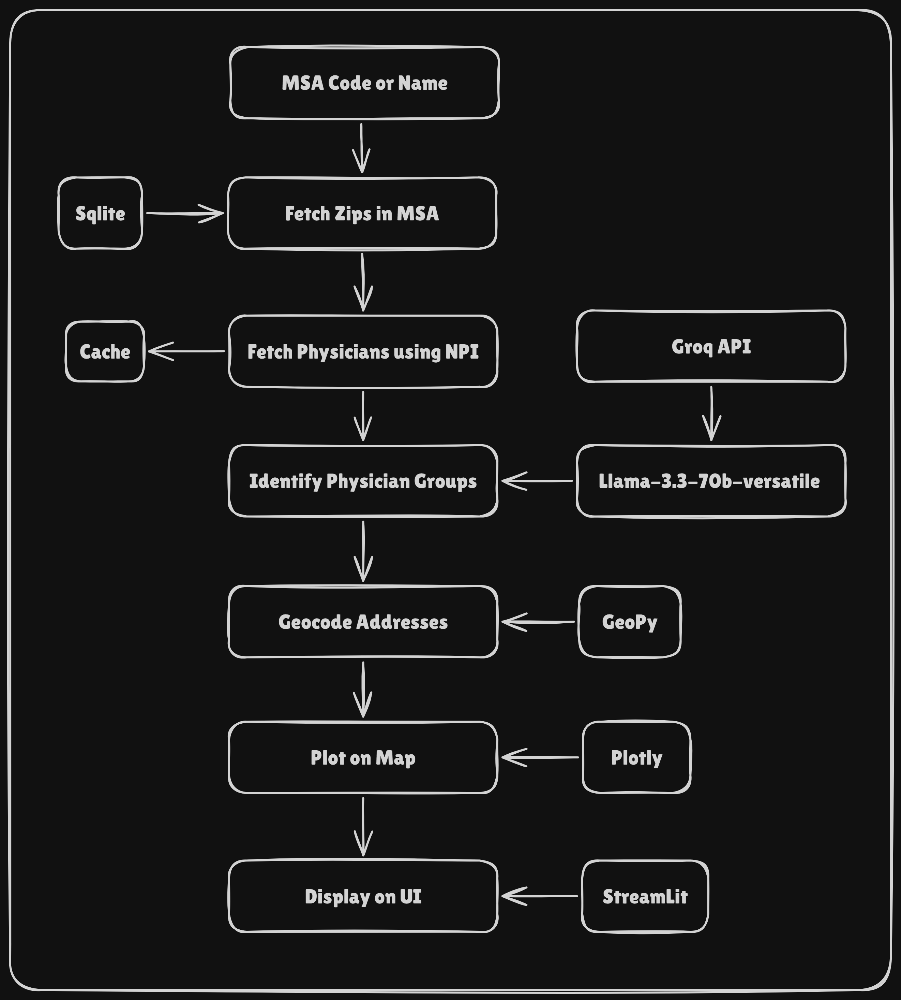

# Physician Locator

## Overview

The Physician Locator is a Streamlit-based application designed to help users find physicians based on location. It provides a user-friendly interface for searching and displaying physician information, making it easier for patients to connect with healthcare providers.

## Features

- **Search Functionality:** Allows users to search for physicians based on location.
- **Interactive Map:** Displays physician locations on an interactive map for easy visualization.
- **Detailed Profiles:** Provides detailed information about each physician, including address, and specialties.
- **User-Friendly Interface:** Built with Streamlit for a simple and intuitive user experience.

## Architecture



## Getting Started

### Prerequisites

- Python 3.7+
- Streamlit
- Plotly
- Geopy
- Geopandas
- Pandas

### Installation

1.  Clone the repository:

    ```bash
    git clone https://github.com/NaveenKumarCIT22/PhysicianLocator-VivnovationTask PhysicianLocator
    ```

2.  Navigate to the project directory:

    ```bash
    cd PhysicianLocator
    ```

3.  Create a virtual environment (recommended):

    ```bash
    python -m venv .venv
    ```

    - Activate the virtual environment:

      - **Windows:**

        ```bash
        .venv\Scripts\activate
        ```

      - **macOS/Linux:**

        ```bash
        source .venv/bin/activate
        ```

4.  Install the dependencies:

    ```bash
    pip install -r requirements.txt
    ```

### Usage

To run the application, use the following command:

```bash
streamlit run ui.py
```


ComboBox selection for MSA name or MSA code


Plotted Map with info tooltip


Physician and Physician Group mapping

## Files

- `ui.py`: The main Streamlit application file containing the user interface and application logic.
- `dataops.ipynb`: Data loading, cleaning, and processing.
- `plot_physician_groups.py`: Includes functions for creating and displaying the interactive map.
- `logger.py`: Logging utility.
- `group_physicians.py`: Uses LLM to identify Physician Groups.
- `load.py`: Fetches physicians data from NPI.
- `datacacher.py`: Caches fetched physicians data zipcode wise.
- `Datas/`: Directory containing the datasets used by the application.
- `physicians/`: Directory containing the cached physicians data zipcode wise.
- `requirements.txt`: List of Python dependencies required to run the application.
- `architecture.png`: Image illustrating the system architecture.
- `image.png`: Image illustrating the input section.
- `image-1.png`: Image illustrating the plotted map.
- `image-2.png`: Image illustrating the physician and physician group mapping.

## Contact

- GMAIL - [naveenkumarm.innovator](naveenkumarm.innovator@gmail.com)
- GITHUB - [NaveenKumarCIT22](https://github.com/NaveenKumarCIT22/)

`! Last commit was to upload the cache files to boost application performance. However, geocoding is still done live which may cause lag.`
